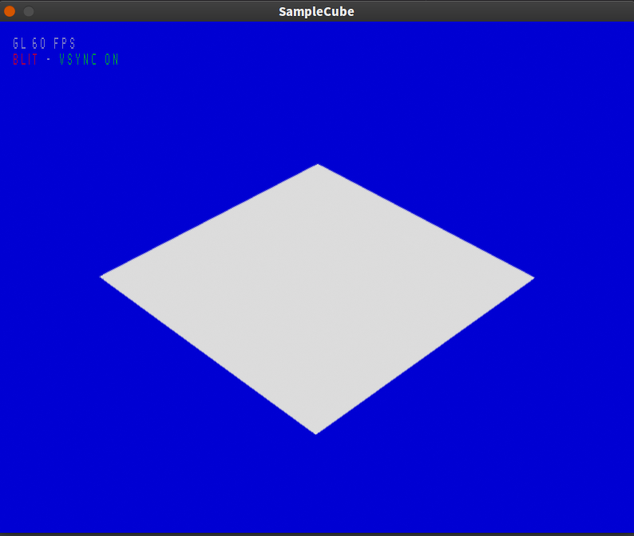

# 2.1 构建模型

**Filament**使用`RenderableManager`来从代码构建模型，典型用法如下：

```kotlin
// 创建实体
val entity = EntityManager.get().create()
// 创建1个Renderable
RenderableManager.Builder(1)
    // 设定包围盒
    .boundingBox(box)
    // 设定顶点和索引数据
    .geometry(0, PrimitiveType.TRIANGLES, vertexBuffer, indexBuffer, offset, size)
    // 设定材质
    .material(0, materialInstance)
    // 创建并绑定到实体
    .build(engine, entity)
```

以上代码的关键在于顶点和索引数据的结构与创建方法，其概念与OpenGL等图形API所描述的相一致。接下来将创建一个单位2×2的+Y法向的X-Z平面来演示如何构建所需数据。

### 2.1.1 顶点缓存 VertexBuffer

首先创建顶点数据缓存，容量=4\(Float字节\)×3\(顶点xyz\)×4\(顶点数\)，并从第三像限顺时针放入了4组顶点坐标，最后将Buffer位置重置到起点。

```kotlin
/**
*           |
*    P1     |     P2
*           |
*           |   
*-----------|----------＞ X
*           |
*           |
*    P0     |     P3
*           |
*           ∨
*           Z
*/
private val mVertexData: Buffer =
        ByteBuffer.allocateDirect(4 * 3 * 4).order(ByteOrder.nativeOrder()).apply {
            asFloatBuffer().put(
                floatArrayOf(
                    -1f, 0f, -1f, // P0
                    -1f, 0f, +1f, // P1
                    +1f, 0f, +1f, // P2
                    +1f, 0f, -1f, // P3
                )
            )
        }.rewind()
```

接下来继续创建法线数据缓存，在**Filament**中并不是接受简单的`Float3`法线数据，而是由**切线-副切线-法线**组成的**四元数**。好在`MathUtils`中提供了`packTangentFrame`来打包四元数。在本例X-Z平面中，\[1,0,0\]是切线\(+X\)，\[0,0,1\]是副切线\(+Z\)，而法线是+Y的\[0,1,0\]。因为平面的4个顶点法线完全一致，这里向Buffer中放入4次计算出的四元数即可。

```kotlin
val tangents = FloatArray(4).apply {
            MathUtils.packTangentFrame(
                1f, 0f, 0f,    // 切线tangent
                0f, 0f, 1f,    // 副切线bitangent
                0f, 1f, 0f,    // 法线normal
                this
            )
        }
private val mTangentData: Buffer = 
        ByteBuffer.allocateDirect(4 * 4 * 4).order(ByteOrder.nativeOrder()).apply {
            asFloatBuffer()
            .put(tangents) // tP0
            .put(tangents) // tP1
            .put(tangents) // tP2
            .put(tangents) // tP3
        }.rewind()
```

接下来创建`VertexBuffer`，顶点数`vertexCount=4`，缓存数`bufferCount=2`；缓存0填充为`POSTION`顶点数据，顶点数据类型为`Float3`；缓存1填充为切线数据，切线数据类型为`Float4`。在创建完成后，最终要将CPU端准备好的数据设置到`VertexBuffer`，**Filament**会异步的将这些数据上传到GPU。

```kotlin
val vertexBuffer = VertexBuffer.Builder()
            .vertexCount(4)
            .bufferCount(2)
            .attribute(VertexAttribute.POSITION, 0, AttributeType.FLOAT3)
            .attribute(VertexAttribute.TANGENTS, 1, AttributeType.FLOAT4)
            .build(engine)
vertexBuffer.setBufferAt(engine, 0, mVertexData)
vertexBuffer.setBufferAt(engine, 1, mTangentData)
```

至此定点缓存`VertexBuffer`构建完成。

### 2.1.1 索引缓存 IndexBuffer

首先创建索引数据缓存，容量=2\(Short字节\)×6\(索引数\)

```kotlin
/**
*   ----------＞X
*   | 1--2  2
*   | | /  /|
*   | |/  / |
*   | 0  0--3
*   ∨
*   Z
*/
private val mIndexData: Buffer =
    ByteBuffer.allocateDirect(2 * 6).order(ByteOrder.nativeOrder()).apply {
        asShortBuffer().put(shortArrayOf(0, 1, 2, 2, 3, 0))
    }
```

接下来就是创建`IndexBuffer`，索引数`indexCount=6`，索引数据类型`USHORT`，最后将CPU端的索引数据设置到`IndexBuffer`。

```kotlin
val indexBuffer = IndexBuffer.Builder()
            .indexCount(6)
            .bufferType(IndexBuffer.Builder.IndexType.USHORT)
            .build(engine)
indexBuffer.setBuffer(engine, mIndexData)
```

至此索引缓存`IndexBuffer`构建完成。

### 2.1.3 创建实体 Entity

回到开篇的内容，我们要用`RenderableManager`创建并绑定到实体。首先创建包围盒中心在\[0,0,0\]，半大小为\[1,0.0001,1\]，最后将上文所创建的`VertexBuffer`和`IndexBuffer`和`BoundingBox`设置给`RenderableManager`，图元类型为三角形`TRIANGLES`，从索引位置0开始绘制6个索引指定的定点数据。

```text
val box = Box(0f, 0f, 0f, 1f, 1E-4f, 1f)
val obj = EntityManager.get().create().apply {
    RenderableManager.Builder(1)
        .boundingBox(box)
        .geometry(0, PrimitiveType.TRIANGLES, vertexBuffer, indexBuffer, 0, 6)
        .build(engine, this)
}
```

### 2.1.4 总结

将创建好的平面模型`Entity`添加到渲染场景`Scene`可以看到我们从代码构建的模型是什么样子了。由于我们并没有给模型添加材质\(后文内容\)，**Filament**自行添加了默认灰白色的材质。



将所有代码组装到`FilaPlane`类方便之后使用，最终代码如下:

> TODO: move to github

```kotlin
typealias RenderableBuilder = RenderableManager.Builder.() -> Unit

data class FilaMesh(
    val entity: Int,
    val indexBuffer: IndexBuffer,
    val vertexBuffer: VertexBuffer,
    val boundingBox: Box
)

fun FilaMesh.destroy(engine: Engine) {
    engine.run {
        destroyIndexBuffer(indexBuffer)
        destroyVertexBuffer(vertexBuffer)
        destroyEntity(entity)
    }
}

interface FilaPrefab {
    fun build(engine: Engine, builder: RenderableBuilder? = null): FilaMesh

    companion object {
        val Plane: FilaPrefab get() = FilaPlane
    }
}


private object FilaPlane : FilaPrefab {
    private val mVertexData: Buffer by lazy {
        ByteBuffer.allocateDirect(4 * 3 * 4).order(ByteOrder.nativeOrder()).apply {
            asFloatBuffer().put(
                floatArrayOf(
                    -1f, 0f, -1f,
                    -1f, 0f, +1f,
                    +1f, 0f, +1f,
                    +1f, 0f, -1f,
                )
            )
        }.rewind()
    }
    private val mTangentData: Buffer by lazy {
        val tangents = FloatArray(4).apply {
            MathUtils.packTangentFrame(
                1f, 0f, 0f,
                0f, 0f, 1f,
                0f, 1f, 0f,
                this
            )
        }
        ByteBuffer.allocateDirect(4 * 4 * 4).order(ByteOrder.nativeOrder()).apply {
            asFloatBuffer().put(tangents).put(tangents).put(tangents).put(tangents)
        }.rewind()
    }
    private val mIndexData: Buffer by lazy {
        ByteBuffer.allocateDirect(2 * 6).order(ByteOrder.nativeOrder()).apply {
            asShortBuffer().put(shortArrayOf(0, 1, 2, 2, 3, 0))
        }
    }

    override fun build(engine: Engine, builder: RenderableBuilder?): FilaMesh {
        val vertexBuffer = VertexBuffer.Builder()
            .vertexCount(4)
            .bufferCount(2)
            .attribute(VertexAttribute.POSITION, 0, AttributeType.FLOAT3)
            .attribute(VertexAttribute.TANGENTS, 1, AttributeType.FLOAT4)
            .build(engine)
        vertexBuffer.setBufferAt(engine, 0, mVertexData)
        vertexBuffer.setBufferAt(engine, 1, mTangentData)

        val indexBuffer = IndexBuffer.Builder()
            .indexCount(6 )
            .bufferType(IndexBuffer.Builder.IndexType.USHORT)
            .build(engine)
        indexBuffer.setBuffer(engine, mIndexData)

        val box = Box(0f, 0f, 0f, 1f, 1E-4f, 1f)
        val obj = EntityManager.get().create().apply {
            RenderableManager.Builder(1)
                .boundingBox(box)
                .geometry(0, PrimitiveType.TRIANGLES, vertexBuffer, indexBuffer, 0, 6)
                .also { builder?.invoke(it) }
                .build(engine, this)
        }
        return FilaMesh(obj, indexBuffer, vertexBuffer, box)
    }
}
```

```kotlin
// to use
val plane = FilaPrefab.Plane.build(engine)
scene.addEntity(plane.entity)

// to destroy
plane.destroy(engine)
```

