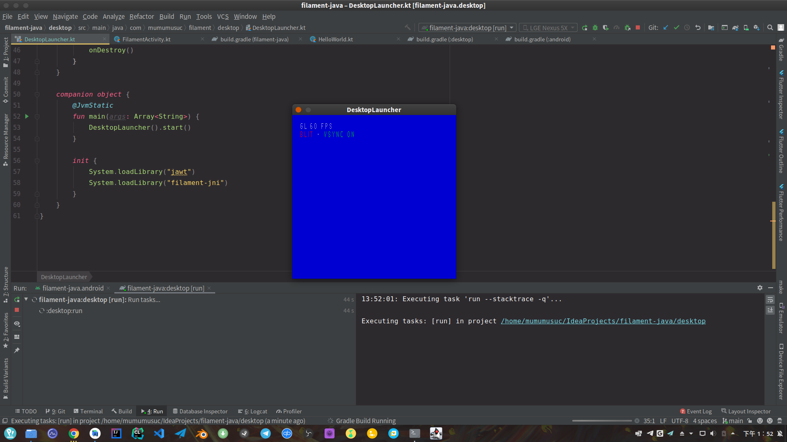
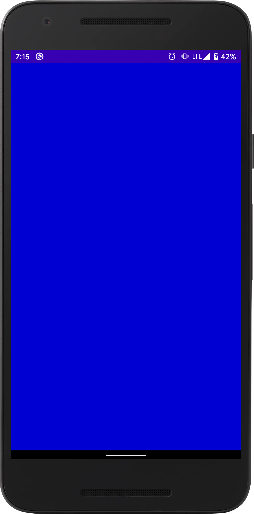

# 1.2 Hello World

一个最简单的Filament程序：

```kotlin
import com.google.android.filament.*

private const val kWindowWidth = 400
private const val kWindowHeight = 400

class HelloWorld {
    private lateinit var mEngine: Engine
    private lateinit var mSwapChain: SwapChain
    private lateinit var mRenderer: Renderer
    private lateinit var mCamera: Camera
    private lateinit var mScene: Scene
    private lateinit var mView: View
    
    fun onCreate() {
        mEngine = Engine.create(Engine.Backend.DEFAULT)
        mRenderer = mEngine.createRenderer()
        mSwapChain = mEngine.createSwapChain(kWindowWidth, kWindowHeight，SwapChain.CONFIG_DEFAULT)
        mCamera = mEngine.createCamera()
        mScene = mEngine.createScene()
        mView = mEngine.createView().apply {
            viewport = Viewport(0, 0, kWindowWidth, kWindowHeight)
            camera = mCamera
            scene = mScene
        }
    }

    fun onRender() {
        if (mRenderer.beginFrame(mSwapChain, 0L)) {
            mRenderer.render(mView)
            mRenderer.endFrame()
        }
    }

    fun onDestroy() {
        mEngine.run {
            destroyView(mView)
            destroyScene(mScene)
            destroyCamera(mCamera)
            destroyRenderer(mRenderer)
            destroySwapChain(mSwapChain)
            destroy()
        }
    }
}
```

在`HelloWorld`  类中简单的把渲染流程分为了：

1. 创建 `onCreate`
2. 渲染 `onRender`
3. 销毁 `onDestroy`


`Engine`, `SwapChain`,`Renderer`,`Camera`,`Scene`和`View` 都是一个渲染流中必不可少的6个模块：

* **Engine** 是Filament一切资源的构造者与管理者，创建`Engine`的线程会被`JobSystem`采用`（adopt）`为主/渲染线程。Filament会检测当前线程是否被采用，在未被采用的线程进行任何资源的创建、释放和渲染都会在Native层抛出错误并终止程序的运行。
* **SwapChain** 是与本地窗口相关的模块，当前帧被`Renderer`绘制到`SwapChain`后将会按设置的帧率提交给本地窗口进行显示。
* **Renderer** 会收集当前的绘制指令并开始绘制`View`中的场景和后期效果。
* **Camera** 观察者视角，每个`View`都必须设置一个`Camera`。
* **Scene** 一个可以添加灯光、天空盒、模型等等的场景，每个`View`都必须设置一个`Scene`。
* **View** 一个视图，包含了本地窗口下的一个视窗`Viewport`、场景`Scene`质量和后期处理`PostEffect`等。


接着在`desktop`模块下的`DesktopLauncher.main()`入口加载这个`HelloWorld`

```kotlin
package com.mumumusuc.filament.desktop

import com.mumumusuc.filament.sample.HelloWorld

class DesktopLauncher {
    companion object {
        @JvmStatic
        fun main(args: Array<String>) {
            HelloWorld().run {
                onCreate()
                onRender()
                onDestroy()
            }
        }

        init {
            System.loadLibrary("jawt")
            System.loadLibrary("filament-jni")
        }
    }
}
```

接下来就可以在Idea等IDE中运行这个桌面程序了，这里向desktop/build.gradle添加了run函数

```groovy
task run(dependsOn: classes, type: JavaExec) {
    def name = 'java.library.path'
    def prop = System.getProperty(name)
    main = 'com.mumumusuc.filament.desktop.DesktopLauncher'
    workingDir = assets
    classpath = sourceSets.main.runtimeClasspath
    systemProperty name, "$prop:$libs"
    standardInput = System.in
}
```

并在终端的项目根目录执行

```bash
mumumusuc@pop-os:~/IdeaProjects/filament-java$ ./gradlew desktop:run -q --stacktrace
FEngine (64 bits) created at 0x7f13dc31d010 (threading is enabled)
FEngine resolved backend: OpenGL
```

因为我们只是创建了一个无主体`(headless)`的`SwapChain` 而没有关联本地窗口，所以并不会出现任何窗口也不会绘制任何图形。因此还需要一些平台相关代码来创建本地窗口并把窗口句柄交给`SwapChain` 。


这里的代码创建了一个无主体的长宽各为400像素的SwapChain，它不会向任何窗口提交所绘制的内容。

```kotlin
mSwapChain = mEngine.createSwapChain(kWindowWidth, kWindowHeight，SwapChain.CONFIG_DEFAULT)
```

但是如果你有离屏渲染`(offscreen render)`的需求，就可能需要`RenderTarget`配合无主体`SwapChain`使用，之后会有示例进行演示。



Filament是一个跨平台的渲染器，SwapChain需要平台的本地窗口的支持

| 平台 | 本地窗口 |
| :--- | :--- |
| `Android` | `ANativeWindow` |
| `macOS - OpenGL` | `NSView` |
| `macOS - Metal` | `CAMetalLayer` |
| `iOS - OpenGL` | `CAEAGLLayer` |
| `iOS - Metal` | `CAMetalLayer` |
| `X11` |  `Window` |
| `Windows` |  `HWND` |

更详细的说明可以参考[源码文档](https://github.com/google/filament/blob/41634a301e8581e56294e4d75639faebb7b6ff5a/filament/include/filament/SwapChain.h#L29)



### Desktop

向`HelloWorld`类中继续添加`onAttach` 、`onResized`和`onDetach`方法，用于响应本地窗口的变化而创建、改变和销毁`SwapChain` 。

```kotlin
    fun onAttach(window: Any) {
        check(mSwapChain == null) {
            println("already attached")
        }
        mSwapChain = mEngine.createSwapChain(window, SwapChain.CONFIG_DEFAULT)
    }

    fun onResized(width: Int, height: Int) {
        mView.viewport = Viewport(0, 0, width, height)
    }

    fun onDetach() {
        mSwapChain?.run {
            mEngine.destroySwapChain(this)
        }
        mSwapChain = null
    }
```

在桌面JVM环境下，Filament接受一个`java.awt.Canvas`对象来创建`SwapChain`。所以接下来我们要在`DesktopLauncher`类中创建窗口和这个`Canvas`对象，并在渲染前`onAttach`到`HelloWorld`中。

```kotlin
    private var mQuit = false
    private val mCanvas: Canvas = Canvas().apply {
        preferredSize = Dimension(kWindowWidth, kWindowHeight)
        isVisible = true
    }
    
    init{
         JFrame(javaClass.simpleName).run {
            addWindowListener(object : WindowAdapter() {
                override fun windowClosing(e: WindowEvent) {
                    mQuit = true
                }
            })
            defaultCloseOperation = JFrame.EXIT_ON_CLOSE
            add(mCanvas)
            pack()
            isResizable = false
            isVisible = true
            setLocationRelativeTo(null)
        }
    }
    
    fun start() {
        HelloWorld().run {
            onCreate()
            onAttach(mCanvas)
            onResized(mCanvas.width, mCanvas.height)
            while (!mQuit) {
                onRender()
                Thread.sleep(16)
            }
            onDetach()
            onDestroy()
        }
    }
```

最后在`DesktopLauncher.main()`入口运行`DesktopLauncher.start()`方法就能看到一个400×400的窗口了。

```kotlin
    @JvmStatic
    fun main(args: Array<String>) {
        DesktopLauncher().start()
    }
```




在Filament官网release页面下载的filament-java.jar文件中包含有`com.google.android.filament.FilamentCanvas`和`com.google.android.filament.FilamentPanel`。前者意义不明，后者使用了实验性的`readPixels`造成了性能灾难。



### Android

有了之前对`HelloWorld`类适度的抽象后，在Android平台运行同一个示例变得非常简单。这里使用了Google在filament-android.aar中打包好的`UiHelper`工具，它可以帮助我们从`SurfaceView`、`TextureView`和`TextureSurface`中获取`ANativeWindow`，并在其状态发生改变时通知我们更新`SwapChain`。最后利用`Choreographer`在Android每次刷新UI时渲染我们的当前帧，这样渲染出的图像就会呈现在`SurfaceView`中。

```kotlin
class FilamentActivity : AppCompatActivity() {
    private val mApp = HelloWorld()
    private val mUiHelper = UiHelper()
    private lateinit var mSurface: SurfaceView

    override fun onCreate(savedInstanceState: Bundle?) {
        super.onCreate(savedInstanceState)
        mSurface = SurfaceView(this).also {
            setContentView(it)
        }
        mUiHelper.renderCallback = object : UiHelper.RendererCallback {
            override fun onNativeWindowChanged(surface: Surface) {
                mApp.onAttach(surface)
            }

            override fun onResized(width: Int, height: Int) {
                mApp.onResized(width, height)
            }

            override fun onDetachedFromSurface() {
                mApp.onDetach()
            }
        }
        mUiHelper.attachTo(mSurface)
        mApp.onCreate()
        Choreographer.getInstance().postFrameCallback(object : Choreographer.FrameCallback {
            override fun doFrame(frameTimeNanos: Long) {
                mApp.onRender()
                Choreographer.getInstance().postFrameCallback(this)
            }
        })
    }

    override fun onDestroy() {
        super.onDestroy()
        mApp.onDestroy()
    }

    companion object {
        init {
            Filament.init()
        }
    }
}

```




本节完整项目：

[https://github.com/mumumusuc/filament-java/tree/v1.2-fixed](https://github.com/mumumusuc/filament-java/tree/v1.2-fixed)

