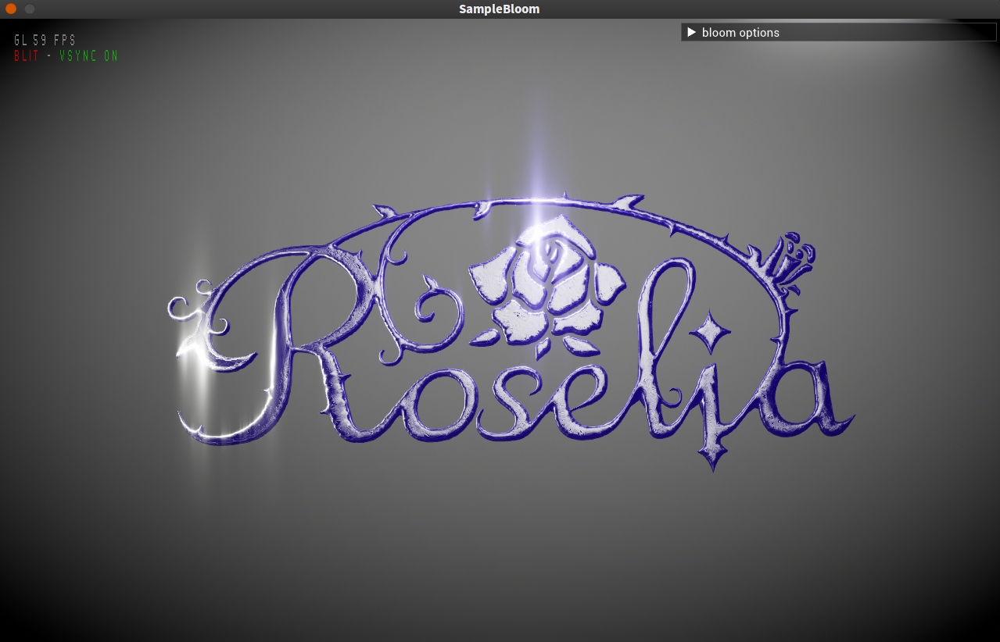
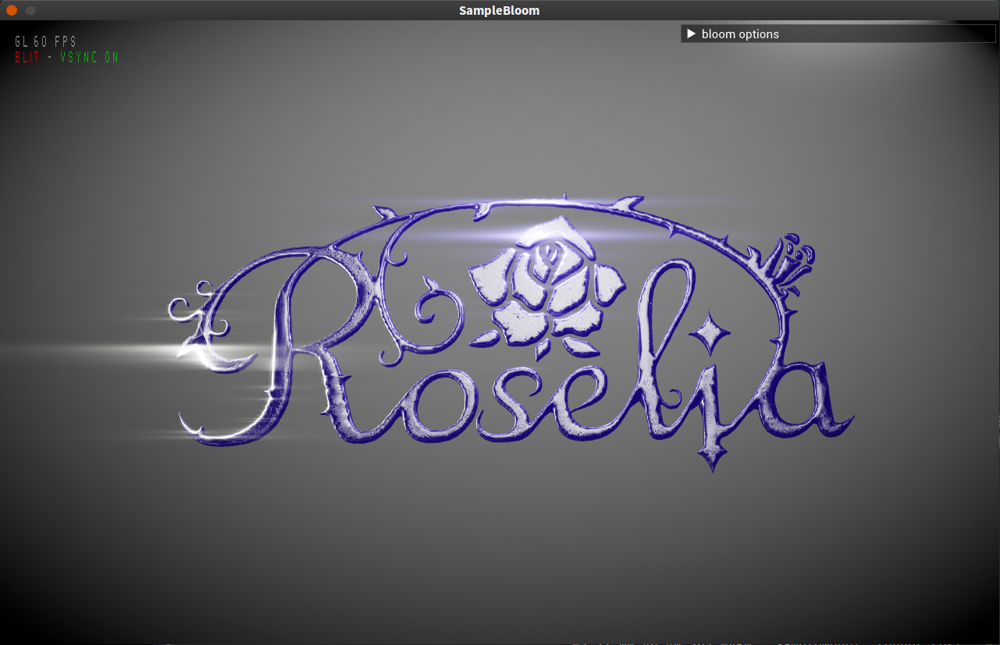
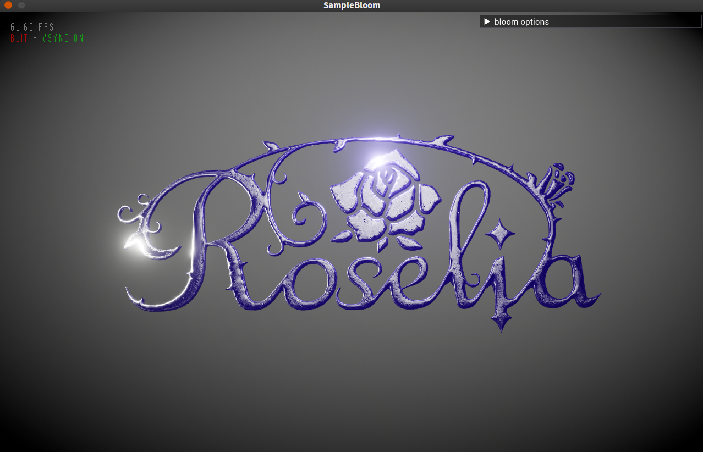
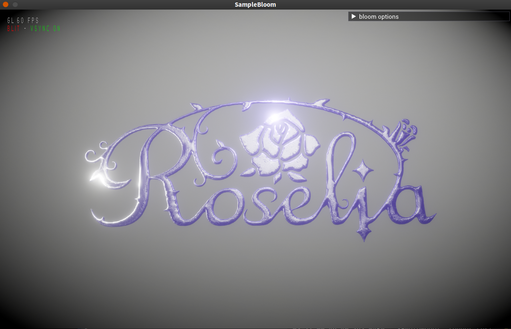
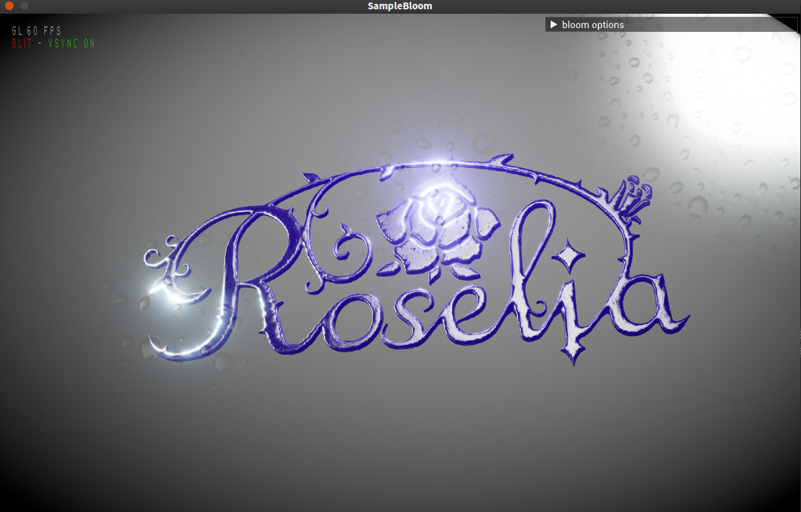

# 5.？ 炫光Bloom

_Filament_提供的`BloomOptions`如下属性:

* **`levels`**:  定义了要连续使用多少次模糊效果，最小值为3，最大值为12。此变量与`resolution`变量共同影响这模糊的扩散效果，同时也可以减小该值来适应原图大小。
* **`resolution`**: 炫光的次轴分辨率，最小值是2^levels，最大值是视图分辨率和4096中的较小值，设置该值时会被自动钳制到最大和最小值之间。在使用动态分辨率dynamic resolution时，

  推荐把此变量设置到比目标分辨率更小。

* **`strength`**: 添加到原图上的炫光强度，在0和1间取值。

<table>
  <thead>
    <tr>
      <th style="text-align:center">
        

          
        

        
<em><code>strength = 0f</code></em>
        

      </th>
      <th style="text-align:center">
        

          
        

        
<em><code>strength = 1f</code></em>
        

      </th>
    </tr>
  </thead>
  <tbody></tbody>
</table>

* **`blendMode`**: 炫光的合成方式，叠加或者混合。

| TODO:image,ADD | TODO:image,MIX |
| :---: | :---: |

* **`anamorphism`**: 炫光的长宽比\(x/y\), 用来实现一些艺术效果。

| _`anamorphism = 0.1f`_  | _`anamorphism = 32f`_  |
| :---: | :---: |

* **`threshold`**: 开启后，只有原图阈值高于1.0的部分才会进行炫光处理。可以用来实现一些艺术效果，或者搭配尘迹贴图dirt texture一同使用。

<table>
  <thead>
    <tr>
      <th style="text-align:center">
        

          
        

        
<em><code>threshold = true</code></em>
        

      </th>
      <th style="text-align:center">
        

          
        

        
<em><code>threshold = false</code></em>
        

      </th>
    </tr>
  </thead>
  <tbody></tbody>
</table>

* **`dirt`**: 灰尘/划痕/污渍贴图，当炫光发生时会在屏幕上进行绘制，与`threshold=true`配合使用。
* **`dirtStrength`**: 尘迹贴图的强度。

<table>
  <thead>
    <tr>
      <th style="text-align:center">
        

          
        

        
<em><code>dirt = Texture(...)</code></em>
        

      </th>
      <th style="text-align:center">
        

          
        

        
<em><code>dirtStrength = 1f</code></em>
        

      </th>
    </tr>
  </thead>
  <tbody></tbody>
</table>

